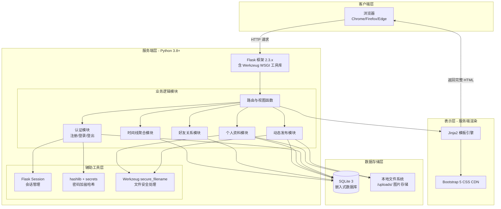

# 开发工作栈（Development Stack）

## 1 工作栈可视化架构图

下图清晰展示了从 **客户端 → Web服务器 → 业务逻辑 → 数据存储** 的完整技术链路：

## 2 工作栈详细配置表

| 分层 | 组件/技术选型 | 版本/规格 | 作用说明 |
| :--- | :--- | :--- | :--- |
| **编程语言** | Python | **3.8 及以上**（3.8~3.12 均可） | 后端核心开发语言，利用其丰富的标准库和极低的上手门槛 |
| **Web 框架** | Flask | **2.3.3** | 提供路由映射、请求/响应对象、Session 管理、模板渲染等核心 Web 能力 |
| **WSGI 服务器** | Werkzeug | **2.3.7** | Flask 依赖的底层 WSGI 工具库，提供开发服务器、文件上传处理、安全辅助函数 |
| **模板引擎** | Jinja2 | 随 Flask 自动安装 | 服务端 HTML 模板渲染，支持模板继承（`layout.html` 基模板），实现页面复用 |
| **数据库引擎** | SQLite 3 | **Python 标准库内置** | 嵌入式关系型数据库，单文件存储（`social.db`），无需独立进程和账号密码配置 |
| **前端样式框架** | Bootstrap 5 | **CDN 在线引用**（不下载本地） | 快速构建响应式、整洁的页面布局，提供卡片、表单、按钮、警告框等预制组件 |
| **前端交互** | 原生 HTML5 + 同步表单提交 | 无额外框架 | 不采用 Vue/React 等 SPA 框架，所有交互通过页面重定向（302/重渲染）完成 |
| **密码加密** | hashlib（SHA256）+ secrets（随机盐） | Python 标准库 | 实现"盐:哈希"格式的密码存储，防止明文泄露和彩虹表攻击 |
| **图片存储** | 本地文件系统 | `/uploads/` 目录 | 动态配图和头像直接存入项目目录下的 `uploads/` 文件夹，数据库存储相对路径 |
| **版本控制** | Git（可选） | 最新稳定版 | 用于代码版本管理，便于回溯和备份（非强制） |

## 3 开发工具链

| 工具 | 用途 | 备注 |
| :--- | :--- | :--- |
| **VS Code** | 代码编辑器 | 推荐安装 Python 和 SQLite 插件，提升开发效率 |
| **DB Browser for SQLite** | 数据库可视化查看工具 | 非必需，但方便调试时直接查看 `social.db` 中的表数据 |
| **Postman / 浏览器开发者工具** | 接口调试 | 用于测试路由返回和查看 Flash 消息 |
| **Mermaid 在线编辑器** | 图表渲染 | 用于查看本说明文档中的流程图和架构图（如 [mermaid.live](https://mermaid.live/)） |