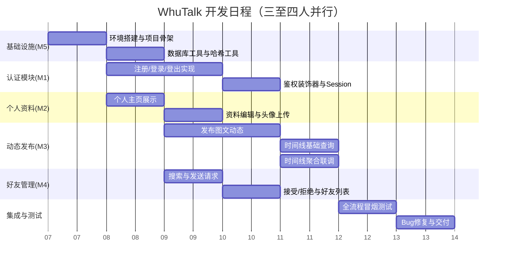

# 开发日程表

## 1 总体日程概览（甘特图）

## 2 逐日任务分解表

| 日期 | 阶段 | 开发者A（组长） | 开发者B | 开发者C | 开发者D（如有） | 每日产出物 |
| :--- | :--- | :--- | :--- | :--- | :--- | :--- |
| **Day 0** | 环境搭建 | • 创建项目目录结构 • 编写 `requirements.txt` • 创建 Git 仓库 • 编写 Flask 骨架（Hello World） | 安装 Python 环境 验证 Flask 安装 | 安装 Python 环境 验证 Flask 安装 | 安装 Python 环境 验证 Flask 安装 | 项目骨架可运行，`python app.py` 启动成功 |
| **Day 1** | 基础设施 + 模块开发启动 | • 编写数据库连接工具 `get_db()` • 编写建表 DDL `init_db()` • 编写密码哈希工具 `hash_password()` / `check_password()` | • 编写 `profile.html` 模板骨架 • 熟悉 `layout.html` 继承方式 | • 编写 `timeline.html` 模板骨架 • 设计动态卡片布局 | • 编写 `friends.html` 模板骨架 • 设计好友列表布局 | `social.db` 自动创建，三张表建表成功 |
| **Day 2** | 认证模块完成 + 各模块开发 | • 实现注册路由（GET/POST） • 实现登录路由（GET/POST） • 实现登出路由 • 实现 `@login_required` 装饰器 | • 实现个人主页展示路由（GET `/profile`） • 查询当前用户信息并渲染 | • 实现发布动态路由（POST `/post`） • 处理文字内容非空校验 | • 实现"搜索用户"表单提交逻辑 | 注册→登录→跳转时间线，完整认证闭环跑通 |
| **Day 3** | 核心功能并行开发 | • 编写 `layout.html` 导航栏 • 协助解决各模块技术阻塞 • 代码审查 | • 实现资料编辑路由（POST `/profile`） • 实现头像上传功能（含文件校验） | • 实现动态列表查询（仅自己） • `timeline.html` 渲染动态卡片 | • 实现"发送好友请求"路由 • 状态机校验（不能加自己/重复请求） | 个人主页可编辑简介+上传头像；个人动态列表正常显示 |
| **Day 4** | 好友管理模块开发 | • 编写 `get_accepted_friend_ids()` 工具函数（供 M3 调用） • 协助调试好友请求逻辑 | • 个人主页展示该用户所有历史动态 • 联调头像显示 | • 完善时间线页面样式 • 发布后自动刷新 | • 实现"接受/拒绝"请求路由 • 实现好友列表查询 • 实现待处理请求列表 | 好友请求可发送、可接受/拒绝、好友列表正常显示 |
| **Day 5** | 时间线聚合联调 | • 统一 Session 和 Flash 消息规范 • 协助联调 M3 与 M4 接口 | • 修复个人主页 Bug • 完善错误提示 | • **接入 `get_accepted_friend_ids()`** • 修改时间线 SQL 为聚合查询 • 联调验证好友动态可见 | • 完善好友管理页面的 Flash 提示 • 处理边界情况（拒绝后重发等） | 时间线同时显示自己和所有已接受好友的动态 |
| **Day 6** | 前端美化与体验优化 | • 统一全站 Flash 消息样式 • 优化导航栏高亮当前页 | • 优化个人主页布局 • 添加默认头像占位 | • 优化时间线卡片样式 • 图片自适应大小 | • 优化好友管理页面布局 • 区分"待处理"和"好友列表"区域 | 所有页面视觉风格统一，体验流畅 |
| **Day 7** | 全流程冒烟测试 | • 编写测试场景清单 • 执行注册→登录→发动态→加好友→刷时间线全流程 | • 测试个人主页所有功能 • 测试头像上传边界情况 | • 测试发布动态（文字/图片/空内容） • 测试时间线排序 | • 测试好友请求所有状态流转 • 测试拒绝后重发 | 全流程冒烟测试通过，记录 Bug 清单 |
| **Day 8** | Bug 修复与代码审查 | • 修复阻塞性 Bug • 最终代码审查 • 合并所有分支到 main | • 修复个人主页相关 Bug • 补充代码注释 | • 修复时间线相关 Bug • 补充代码注释 | • 修复好友系统相关 Bug • 补充代码注释 | Bug 清零，代码合并完成 |
| **Day 9** | 交付准备（可选） | • 撰写 README.md • 编写项目启动文档 • 录制功能演示视频 | 协助文档编写 | 协助文档编写 | 协助文档编写 | 完整交付物：源码 + README + 演示视频 |
| **Day 10** | 缓冲期（预留） | • 处理突发问题 • 额外功能扩展（如需要） | — | — | — | 项目稳定可交付 |

## 3 验收标准（每日 Checkpoint）

| 日期 | 验收检查点 | 通过标准 |
| :--- | :--- | :--- |
| Day 1 | 数据库初始化 | 启动应用后 `social.db` 文件生成，使用 DB Browser 查看三张表结构正确 |
| Day 2 | 认证闭环 | 注册新用户 → 登录 → 看到时间线首页；未登录访问 `/profile` 被拦截跳转登录页 |
| Day 3 | 个人资料闭环 | 登录后进入个人主页，可修改简介并保存；上传头像后刷新页面头像更新 |
| Day 4 | 动态发布闭环 | 发布含文字+图片的动态，动态出现在个人主页列表和时间线列表 |
| Day 5 | 好友请求闭环 | A 搜索 B 发送请求 → B 登录看到待处理 → B 接受 → A 的好友列表中出现 B |
| Day 6 | 时间线聚合闭环 | 登录 A，时间线同时显示 A 自己和 B、C 等所有已接受好友的动态 |
| Day 7 | 全流程冒烟 | 按 SRS 中 7 个 User Stories 逐一验证，全部通过 |
| Day 8 | Bug 清零 | 测试过程中发现的所有 Bug 已修复，无遗留阻塞问题 |

## 4 风险提示与应对

| 潜在风险 | 影响 | 应对措施 |
| :--- | :--- | :--- |
| **接口约定不一致** | M3（时间线）无法正确获取好友列表 | Day 4 前组长 A 需明确定义 `get_accepted_friend_ids()` 的函数签名和返回值格式，并写入协作文档 |
| **Git 合并冲突** | 多人同时修改 `app.py` 导致冲突 | 各开发者严格在自己分支开发，每日下班前向 main 发起 Pull Request，由组长 A 负责合并 |
| **前端样式不统一** | 不同页面的导航栏、按钮、表单风格不一致 | 所有页面继承自 `layout.html`，由 A 统一维护导航栏和基础样式，各开发者只修改 `` 区域 |
| **文件上传路径问题** | 头像或动态图片无法正常显示 | 统一使用 `url_for('static', filename='../uploads/xxx')` 生成图片 URL，各模块遵循相同规范 |

## 5 分工速查卡（每位开发者随身清单）

| 角色 | 负责路由 | 负责模板 | 对外提供接口 | 依赖项 |
| :--- | :--- | :--- | :--- | :--- |
| **A（组长）** | `/register`, `/login`, `/logout` | `layout.html`, `login.html`, `register.html` | `get_db()`, `hash_password()`, `check_password()`, `@login_required` | 无 |
| **B** | `/profile` (GET/POST) | `profile.html` | 无 | `get_db()`, `@login_required` |
| **C** | `/post` (POST), `/timeline` (GET) | `timeline.html` | 无（调用 `get_accepted_friend_ids()`） | `get_db()`, `@login_required`, **A/D 提供的 `get_accepted_friend_ids()`** |
| **D** | `/friends` (GET/POST) | `friends.html` | **`get_accepted_friend_ids(user_id)`** | `get_db()`, `@login_required` |