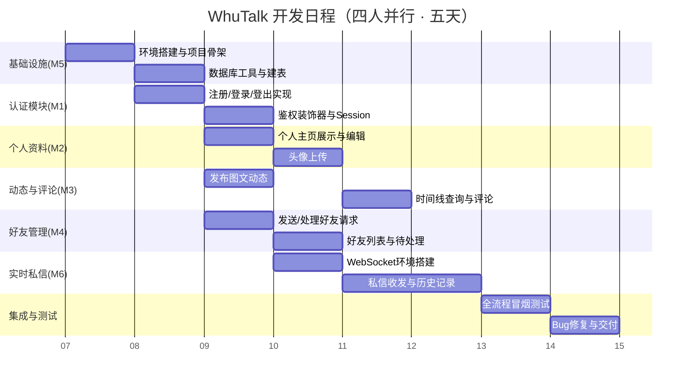

# 开发日程表

## 1 总体日程概览（甘特图）

## 2 逐日任务分解表

| 日期 | 阶段 | 开发者A（组长） | 开发者B | 开发者C | 开发者D | 每日产出物 |
| :--- | :--- | :--- | :--- | :--- | :--- | :--- |
| **Day 1** | 基础设施 + 认证 + 各模块启动 | • 创建项目目录结构 • 编写 `requirements.txt`（含 Flask-SocketIO、eventlet） • 创建 Git 仓库 • 编写 Flask 骨架 • 编写数据库连接工具 `get_db()` • 编写建表 DDL（含 5 张表） • 编写密码哈希工具 | • 安装 Python 环境 • 验证 Flask 安装 • 编写 `layout.html` 基础模板 | • 安装 Python 环境 • 验证 Flask 安装 • 编写 `login.html` / `register.html` | • 安装 Python 环境 • 验证 Flask 安装 • 设计数据字典与 ER 图确认 | 项目骨架可运行，`social.db` 自动创建（5 张表），认证页面可访问 |
| **Day 2** | 认证模块完成 + 个人资料 + 好友管理 | • 实现注册路由（GET/POST） • 实现登录路由（GET/POST） • 实现登出路由 • 实现 `@login_required` 装饰器 | • 实现个人主页展示（GET `/profile`） • 实现资料编辑与头像上传（POST `/profile`） • 联调头像显示 | • 实现发布动态路由（POST `/post`） • 实现时间线基础查询（仅自己） • 处理文字内容非空校验 | • 实现"搜索用户"表单提交逻辑 • 实现"发送好友请求"路由 • 状态机校验（不能加自己/重复请求） | 注册→登录→跳转时间线；个人主页可编辑；好友请求可发送 |
| **Day 3** | 动态聚合 + 好友请求闭环 + 评论 | • 编写 `get_accepted_friend_ids()` 工具函数 • 编写 `layout.html` 导航栏（含消息入口） • 协助联调 M3 与 M4 接口 | • 个人主页展示该用户所有历史动态 • 联调头像显示 • 添加默认头像占位 | • **接入 `get_accepted_friend_ids()`** • 修改时间线 SQL 为聚合查询（自己+好友） • 实现评论发表与展示（FR-13/14） • 修改 `timeline.html` 嵌入评论功能 | • 实现"接受/拒绝"请求路由 • 实现好友列表查询 • 实现待处理请求列表 • 完善好友管理页面 Flash 提示 | 时间线聚合显示好友动态；好友请求可接受/拒绝；评论功能可用 |
| **Day 4** | 实时私信模块开发 | • 配置 Flask-SocketIO + eventlet • 修改启动脚本为 `socketio.run()` • 实现 `connect` / `disconnect` 事件（Session 鉴权 + 在线管理） • 实现 `private_message` 事件（存储 + 实时转发） | • 协助测试私信功能 • 修复个人主页/资料相关 Bug • 补充代码注释 | • 修复时间线/评论相关 Bug • 优化时间线卡片样式 • 补充代码注释 | • 实现 `mark_read` 事件 • 实现 HTTP GET `/chat` 会话列表 • 实现 HTTP GET `/chat/<friend_id>` 聊天历史 • 编写 `chat.html` 页面骨架 | 私信收发可用；会话列表显示未读计数；聊天历史正常加载 |
| **Day 5** | 前端联调 + 私信页面 + 测试交付 | • 统一全站 Flash 消息样式 • 优化导航栏高亮当前页 • 最终代码审查 • 合并所有分支到 main | • 编写 `chat.html` 前端 JS（Socket 连接、消息收发、动态渲染） • 联调 WebSocket 通信 • 测试私信全流程 | • 执行全流程冒烟测试 • 编写测试场景清单 • 记录并修复 Bug | • 完善私信页面样式 • 优化未读红点显示 • 协助测试好友→私信闭环 | 完整功能演示通过，可交付 |

## 3 验收标准（每日 Checkpoint）

| 日期 | 验收检查点 | 通过标准 |
| :--- | :--- | :--- |
| Day 1 | 环境与数据库就绪 | `python app.py` 启动成功，访问 `127.0.0.1:5000` 显示页面；`social.db` 包含 5 张表 |
| Day 2 | 认证 + 个人资料 + 好友发送 | 注册→登录→编辑资料→搜索用户→发送好友请求，全流程跑通 |
| Day 3 | 动态聚合 + 好友闭环 + 评论 | 时间线显示自己和好友动态；好友请求可接受/拒绝；评论发表并展示 |
| Day 4 | 私信后端就绪 | WebSocket 连接成功；在线用户可实时收发消息；消息入库；会话列表显示未读计数 |
| Day 5 | 完整演示交付 | 双浏览器模拟 A↔B：加好友→实时聊天→查看历史→未读标记，全流程演示通过 |

## 4 风险提示与应对

| 潜在风险 | 影响 | 应对措施 |
| :--- | :--- | :--- |
| **WebSocket Session 鉴权** | Socket 连接无法识别当前登录用户 | Day 4 前组长 A 需提前研究 `request.cookies` 提取 Session 的方案，或采用 `flask-session` 配合 `eventlet` 的 `monkey_patch` |
| **接口约定不一致** | M3（时间线）无法正确获取好友列表 | Day 3 前组长 A 明确定义 `get_accepted_friend_ids()` 的函数签名，并写入协作文档 |
| **Git 合并冲突** | 多人同时修改 `app.py` | 各开发者严格在自己分支开发，每日下班前向 main 发起 PR，由组长 A 负责合并 |
| **前端样式不统一** | 聊天页风格与其他页不一致 | 所有页面继承 `layout.html`，C 和 D 开发时参考 B 已完成的页面样式 |
| **实时私信前端 JS 复杂** | 开发者 B 对 JavaScript 不熟悉 | Day 4 下班前组长 A 提供 Socket.IO 前端连接/收发/渲染的示例代码片段 |

## 5 分工速查卡（每位开发者随身清单）

| 角色 | 负责模块 | 负责路由/事件 | 负责模板 | 对外提供接口 | 依赖项 |
| :--- | :--- | :--- | :--- | :--- | :--- |
| **A（组长）** | M5 + M1 + M6（后端） | `/register`, `/login`, `/logout`, Socket 事件（`connect`, `disconnect`, `private_message`） | `layout.html`, `login.html`, `register.html` | `get_db()`, `hash_password()`, `check_password()`, `@login_required`, `online_users` 管理 | 无 |
| **B** | M2 + M6（前端） | `/profile` (GET/POST), `/chat` 页面 JS | `profile.html`, `chat.html`（JS 部分） | 无 | `get_db()`, `@login_required`, Socket.IO 客户端 |
| **C** | M3（动态 + 评论） | `/post` (POST), `/timeline` (GET), `/comment/<post_id>` (POST) | `timeline.html` | 无（调用 `get_accepted_friend_ids()`） | `get_db()`, `@login_required`, **A 提供的 `get_accepted_friend_ids()`** |
| **D** | M4 + M6（HTTP 路由） | `/friends` (GET/POST), `/chat` (GET), `/chat/<friend_id>` (GET), `mark_read` 事件 | `friends.html`, `chat.html`（HTML 结构） | **`get_accepted_friend_ids(user_id)`**（由 A 封装） | `get_db()`, `@login_required` |
