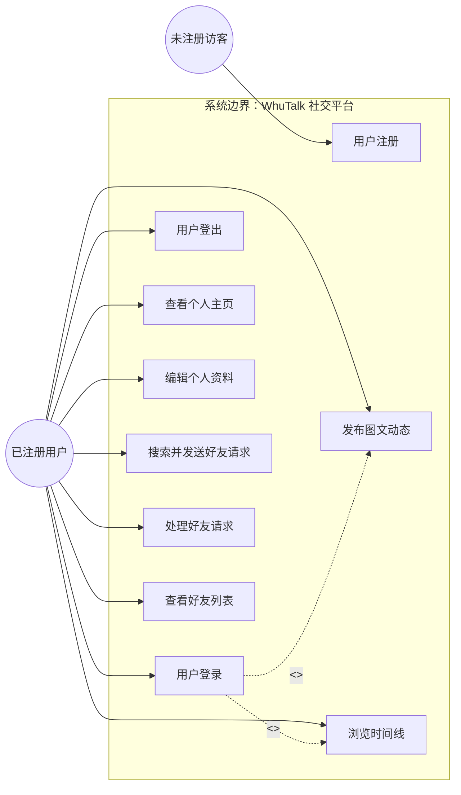
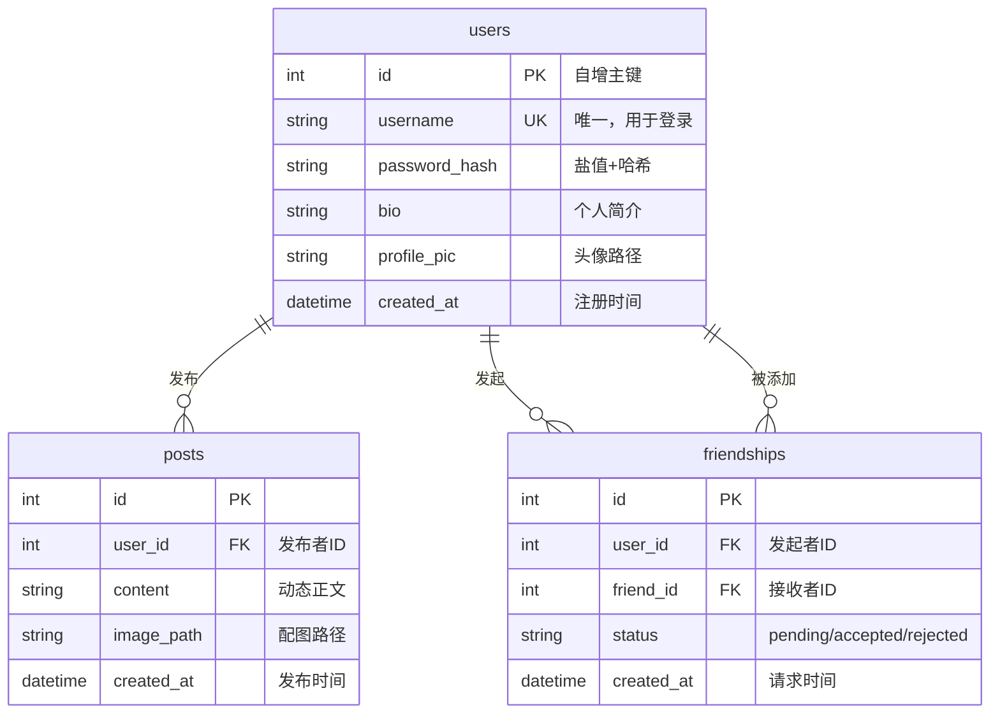
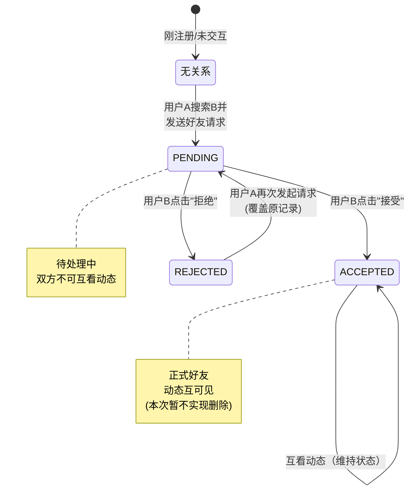
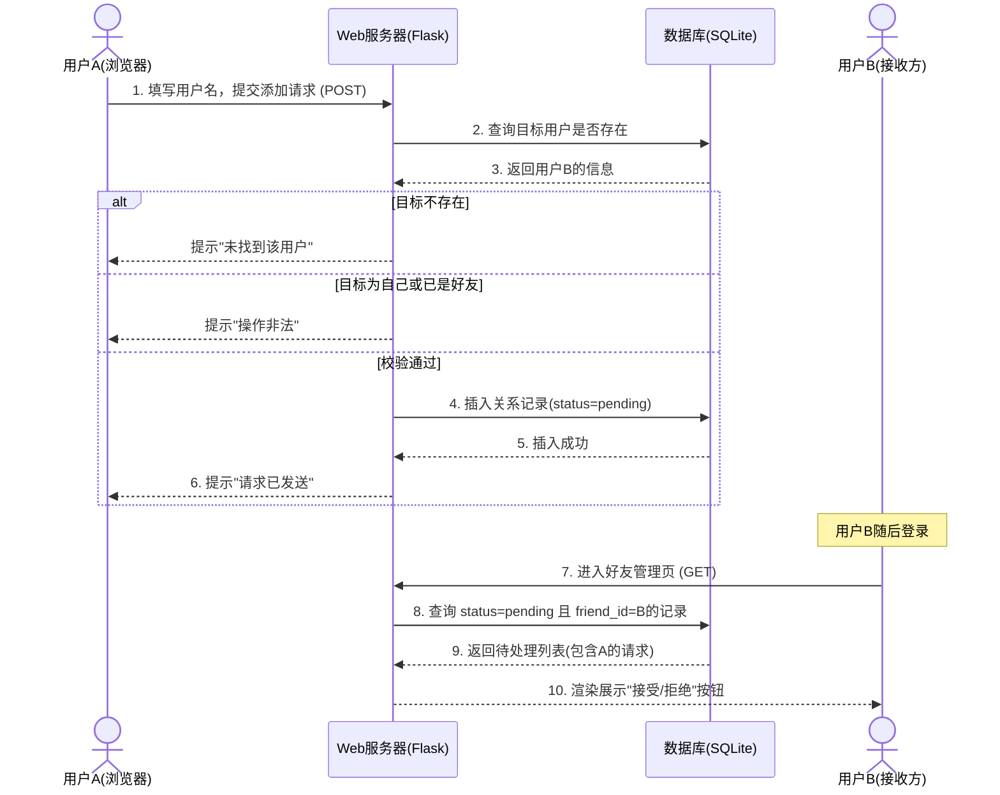
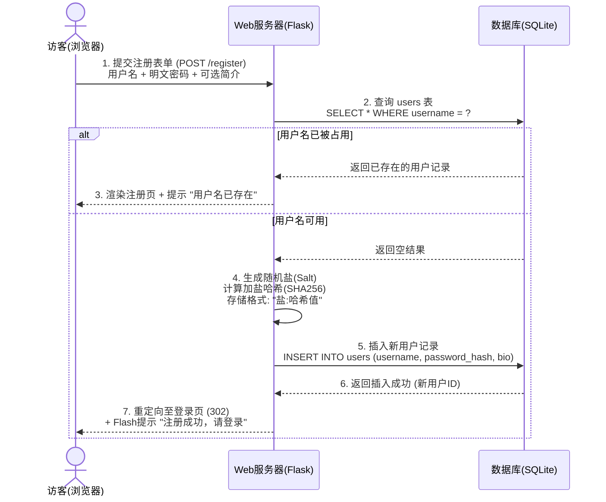
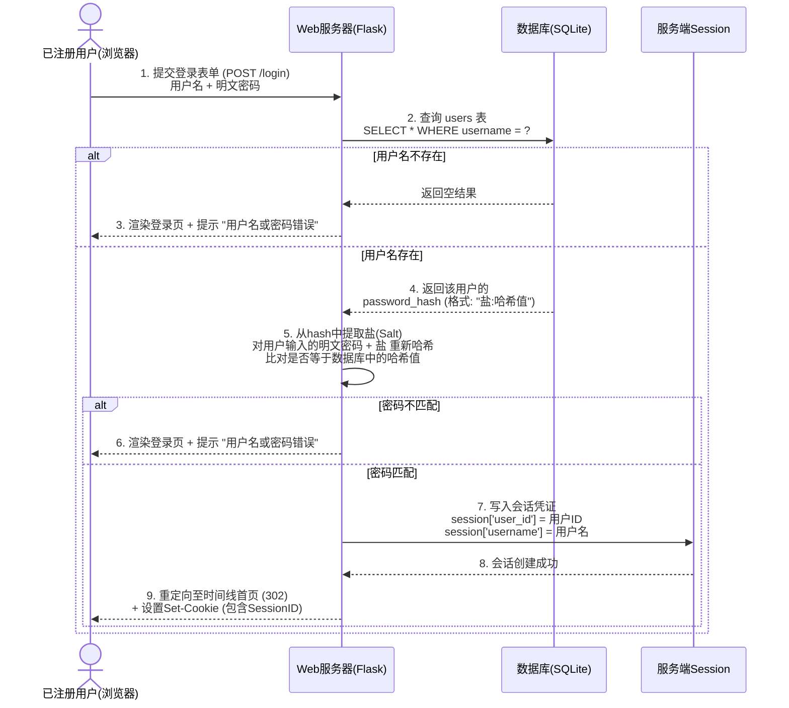
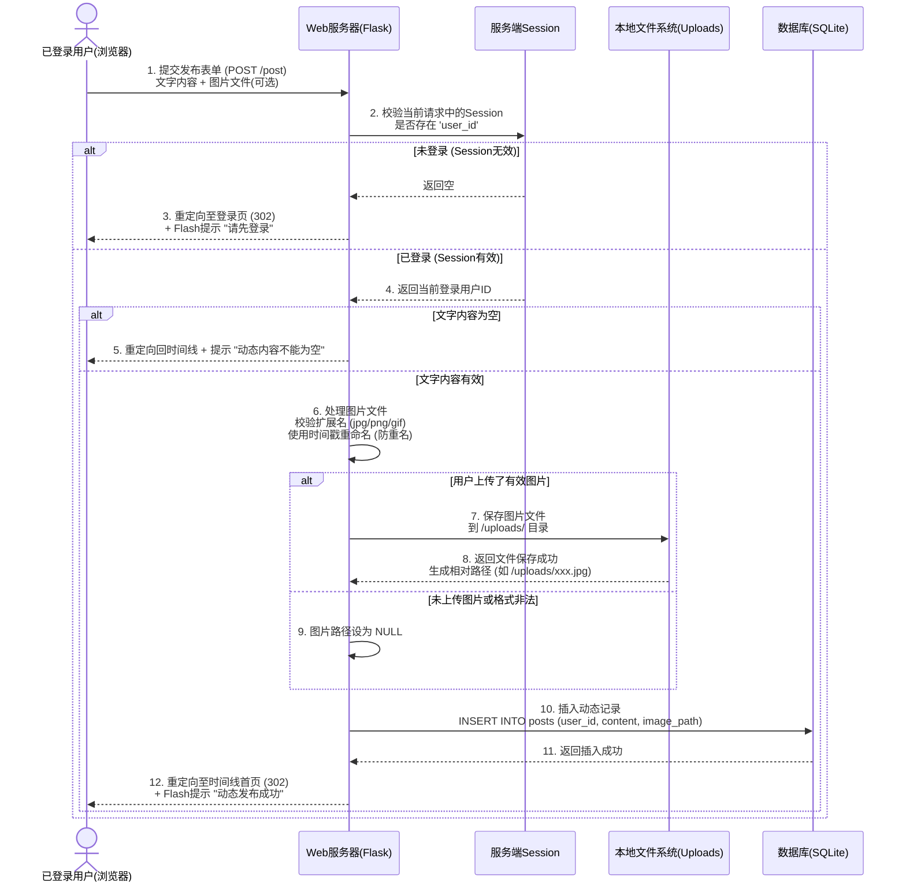

# WhuTalk — 简易社交平台 — 需求规格说明书

---

## 1.用户需求说明

### 1.1 用户角色定义

|角色编号|角色名称|角色描述|
|---|---|---|
|R-01|未注册访客|尚未注册账号，仅可访问登录页和注册页|
|R-02|已注册用户|拥有有效账号，可登录并使用全部功能|

### 1.2 用户业务操作场景（User Stories）

|场景编号|对应角色|场景描述|
|---|---|---|
|S-00|R-01|作为未注册访客，我希望填写用户名和密码进行账号注册，以便系统为我创建唯一身份，从而获得登录并使用平台的权限。|
|S-01|R-02|作为已注册用户，我希望输入用户名和密码登录系统，以便获得发布动态和管理好友的权限。|
|S-02|R-02|作为已注册用户，我希望修改个人简介和上传头像，以便向好友展示我的个性化信息。|
|S-03|R-02|作为已注册用户，我希望发布包含文字和配图的动态，以便记录和分享我的生活。|
|S-04|R-02|作为已注册用户，我希望按时间倒序查看我和所有好友的动态，以便不错过任何近况更新。|
|S-05|R-02|作为已注册用户，我希望通过用户名搜索其他用户并发送好友请求，以便建立社交关系。|
|S-06|R-02|作为已注册用户，我希望收到待处理请求并选择接受或拒绝，以便管理我的社交圈子。|
|S-07|R-02|作为已注册用户，我希望查看当前所有已建立的好友列表，以便清楚我的社交圈范围。|

### 1.3 核心业务流程闭环（闭环逻辑）

- 注册与鉴权闭环：访客提交注册信息 → 系统生成账号并返回登录页 → 用户提交凭证 → 系统颁发会话凭证（Session） → 后续所有操作携带凭证。

- 社交关系闭环：用户A搜索用户B → 系统生成“待处理”关系记录 → 用户B登录查看通知 → 用户B执行“接受”或“拒绝” → 系统变更关系状态 → 关系生效或终结。

- 动态生产与消费闭环：用户发布动态（文字+图片） → 系统存储内容并关联发布者ID → 该用户及其好友刷新时间线 → 系统聚合查询并倒序渲染展示。

## 2.需求分析建模

### 2.1 系统用例图（Use Case Diagram）—— 定义功能边界

### 2.2 实体-关系图（ER Diagram）—— 定义数据结构

### 2.3 完整数据字典（Data Dictionary）

#### 2.3.1 用户表（users）

| 字段名 | 数据类型 | 空值（NULL） | 默认值 | 键/约束 | 索引建议 | 业务描述 |
| :--- | :--- | :--- | :--- | :--- | :--- | :--- |
| **id** | `INTEGER` | **NOT NULL** | 自动递增 | **PRIMARY KEY** | 主键自动索引 | 系统内部唯一标识，自增数字，不对外暴露业务含义 |
| **username** | `TEXT` (VARCHAR(50)) | **NOT NULL** | 无 | **UNIQUE** | 创建唯一索引 | 用户登录账号和搜索依据。**全局唯一**，长度限制 50 字符，建议字母/数字/下划线组成 |
| **password_hash** | `TEXT` (VARCHAR(128)) | **NOT NULL** | 无 | 无 | 无 | 存储加盐后的密码哈希值，格式固定为 `盐(16位十六进制):SHA256哈希值(64位)`，**严禁明文存储** |
| **bio** | `TEXT` | 允许 NULL | `NULL` | 无 | 无 | 用户个人简介，最长建议 200 字符，展示在个人主页 |
| **profile_pic** | `TEXT` (VARCHAR(200)) | 允许 NULL | `NULL` | 无 | 无 | 头像图片的相对路径（如 `uploads/avatar_1_20260706.jpg`）。若为空，前端展示默认头像 |
| **created_at** | `TIMESTAMP` / `DATETIME` | **NOT NULL** | `CURRENT_TIMESTAMP` | 无 | 建议按需（时间排序查询） | 账号注册时间，系统自动生成，不可手动修改 |

#### 2.3.2 动态表（posts）

| 字段名 | 数据类型 | 空值（NULL） | 默认值 | 键/约束 | 索引建议 | 业务描述 |
| :--- | :--- | :--- | :--- | :--- | :--- | :--- |
| **id** | `INTEGER` | **NOT NULL** | 自动递增 | **PRIMARY KEY** | 主键自动索引 | 动态唯一标识 |
| **user_id** | `INTEGER` | **NOT NULL** | 无 | **FOREIGN KEY (users.id)** | **必须创建索引**（高频查询条件） | 发布者的用户ID。**外键关联**，用于联表查询发布者昵称/头像 |
| **content** | `TEXT` | **NOT NULL** | 无 | 无 | 无 | 动态正文内容。**数据库层非空**，应用层需额外校验不能为纯空白字符 |
| **image_path** | `TEXT` (VARCHAR(200)) | 允许 NULL | `NULL` | 无 | 无 | 配图相对路径（如 `uploads/20260706120000_photo.jpg`）。为空表示纯文字动态 |
| **created_at** | `TIMESTAMP` / `DATETIME` | **NOT NULL** | `CURRENT_TIMESTAMP` | 无 | **创建复合索引** `(user_id, created_at DESC)` | 发布时间戳。**时间线按此字段降序排序**，是核心查询依据字段 |

#### 2.3.3 好友关系表（friendships）

| 字段名 | 数据类型 | 空值（NULL） | 默认值 | 键/约束 | 索引建议 | 业务描述 |
| :--- | :--- | :--- | :--- | :--- | :--- | :--- |
| **id** | `INTEGER` | **NOT NULL** | 自动递增 | **PRIMARY KEY** | 主键自动索引 | 好友关系记录唯一标识 |
| **user_id** | `INTEGER` | **NOT NULL** | 无 | **FOREIGN KEY (users.id)** | **创建复合索引** `(user_id, status)` | **发起请求方**的ID（主动加好友的人） |
| **friend_id** | `INTEGER` | **NOT NULL** | 无 | **FOREIGN KEY (users.id)** | **创建复合索引** `(friend_id, status)` | **接收请求方**的ID（被加好友的人） |
| **status** | `TEXT` (VARCHAR(10)) | **NOT NULL** | `'pending'` | **CHECK 约束**（仅允许 `pending`/`accepted`/`rejected`） | 见上述复合索引 | 关系状态。仅允许三个枚举值，用于控制好友请求的生命周期 |
| **created_at** | `TIMESTAMP` / `DATETIME` | **NOT NULL** | `CURRENT_TIMESTAMP` | 无 | 无 | 好友请求的发送时间（**注意**：该字段不随状态变更而更新，保留初始请求时间） |

##### 2.3.3.1 friendships 表额外约束（表级）

| 约束类型 | 约束内容 | 业务说明 |
| :--- | :--- | :--- |
| **UNIQUE 约束** | `(user_id, friend_id)` **联合唯一** | 防止同一对发起者→接收者重复发送请求。注意该约束是单向的（A→B 唯一），并不阻止 B→A 再发一条（两者被视为不同的“主动方向”）。业务层需结合逻辑判断，若 A→B 或 B→A 任一存在 `pending`/`accepted` 状态则拦截 |
| **CHECK 约束** | `status IN ('pending', 'accepted', 'rejected')` | 数据库层强校验，防止应用程序误写入非法状态值 |

### 2.4 好友关系状态机图（State Machine）—— 定义业务生命周期

### 2.5 核心业务时序图（Sequence Diagram）—— 定义交互顺序

#### 2.5.1 申请添加好友时序图

#### 2.5.2 用户注册时序图

#### 2.5.3 用户登录时序图

#### 2.5.4 发布图文动态时序图

## 3.非功能性需求说明

### 3.1开发环境

| 环境项 | 版本/规格要求 | 说明 |
| :--- | :--- | :--- |
| **操作系统** | Windows 10/11、macOS 10.15+、Ubuntu 18.04+ | 跨平台均可，无特殊内核依赖 |
| **Python 解释器** | **Python 3.8 及以上版本**（含 3.9、3.10、3.11、3.12） | 必须使用 Python 3.x，**不支持 Python 2.x** |
| **包管理工具** | `pip`（版本 ≥ 20.0） | 用于安装项目依赖项 |
| **代码编辑器** | VSCode / PyCharm / Sublime Text 任选 | 无强制要求，文本编辑器即可 |
| **终端/命令行** | Windows CMD/PowerShell、macOS Terminal、Linux Shell | 用于执行启动命令 |

### 3.2 运行环境

| 环境项 | 版本/规格要求 | 说明 |
| :--- | :--- | :--- |
| **服务器主机** | 本地个人电脑 或 云服务器（最低配置：1核CPU / 512MB内存） | 开发阶段直接运行于本机，生产部署可上传至轻量云服务器 |
| **数据库** | **SQLite 3**（Python 标准库自带，无需单独安装） | 数据库文件（`social.db`）随项目生成，无需外部数据库服务 |
| **Web 服务器** | Flask 内置开发服务器（Werkzeug） | 通过 `python app.py` 启动，默认监听 `127.0.0.1:5000` |
| **客户端浏览器** | Chrome / Firefox / Edge / Safari 最新稳定版 | 用于访问网页界面，无需安装任何插件 |

### 3.3 系统依赖项

| 依赖包名称 | 版本推荐 | 作用描述 |
| :--- | :--- | :--- |
| **Flask** | `2.3.3` | 提供 Web 路由、Session 管理、模板渲染核心能力 |
| **Werkzeug** | `2.3.7` | Flask 底层 WSGI 工具库（含文件上传处理、安全辅助函数） |
| **blinker** | `1.6.2` | Flask 信号支持库（随 Flask 安装，建议显式锁定版本） |
