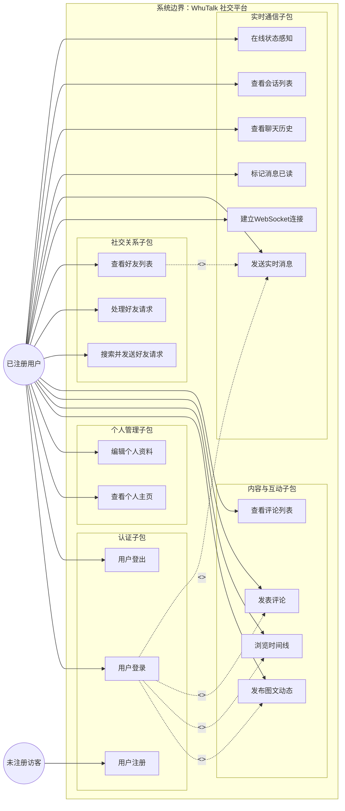
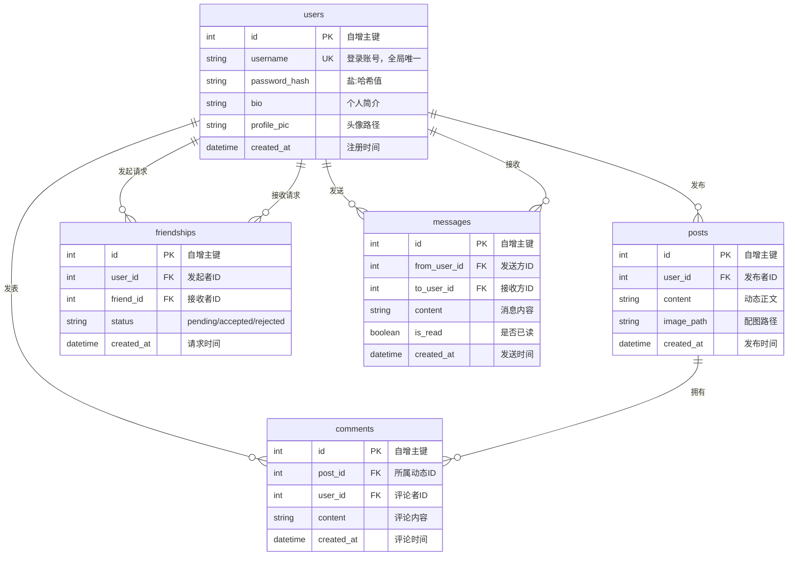
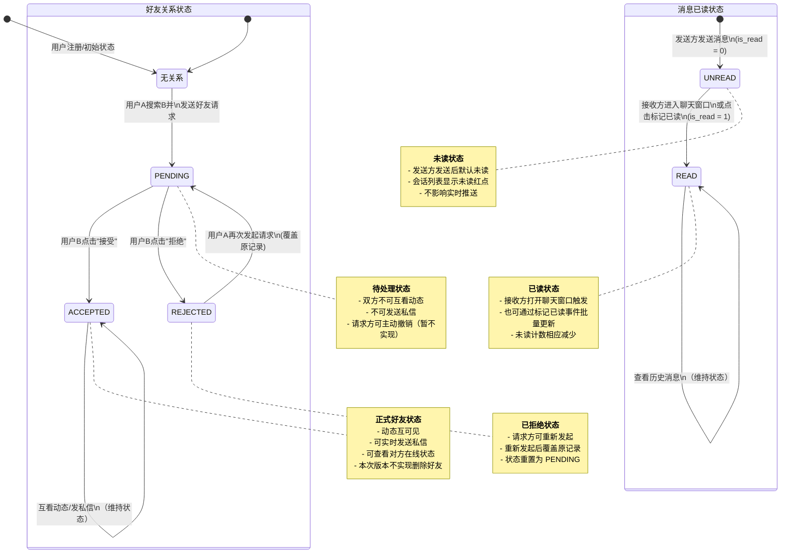
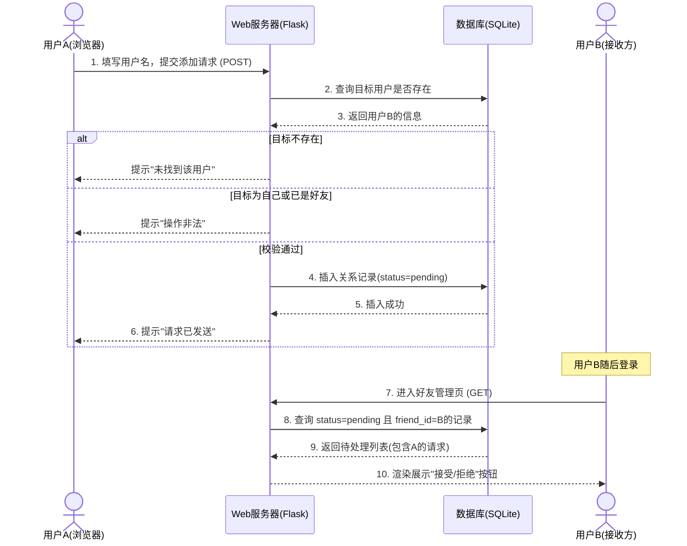
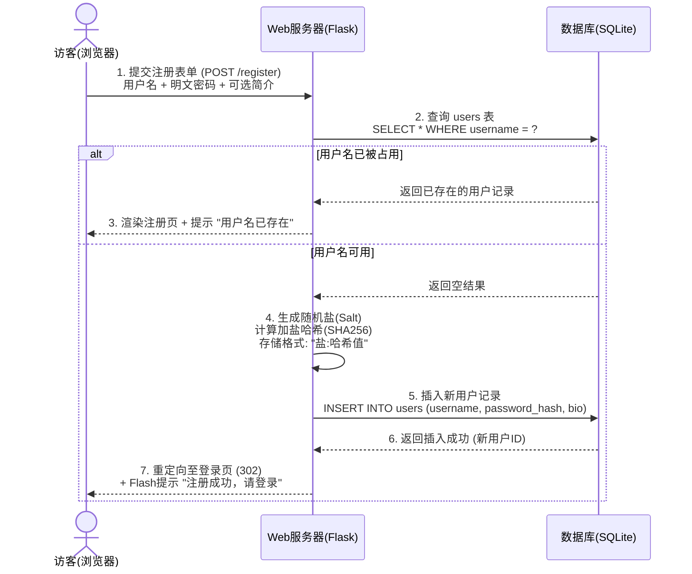
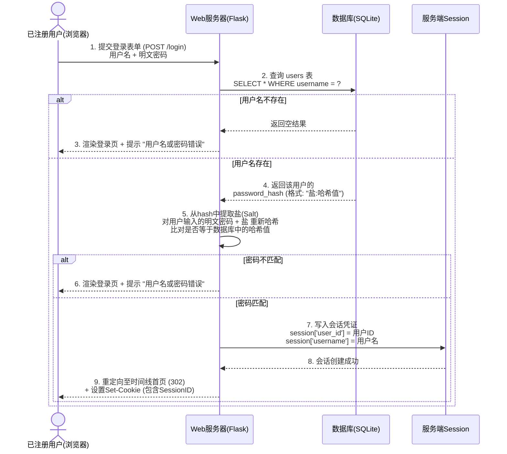
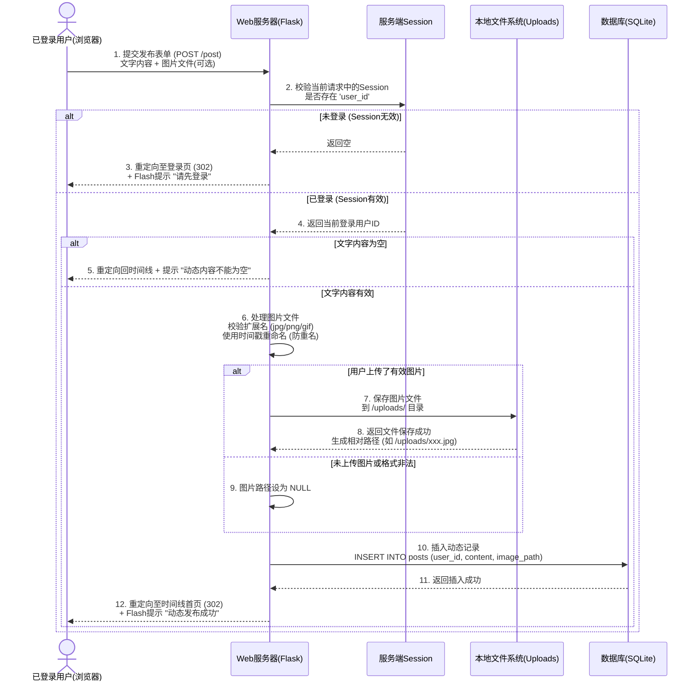
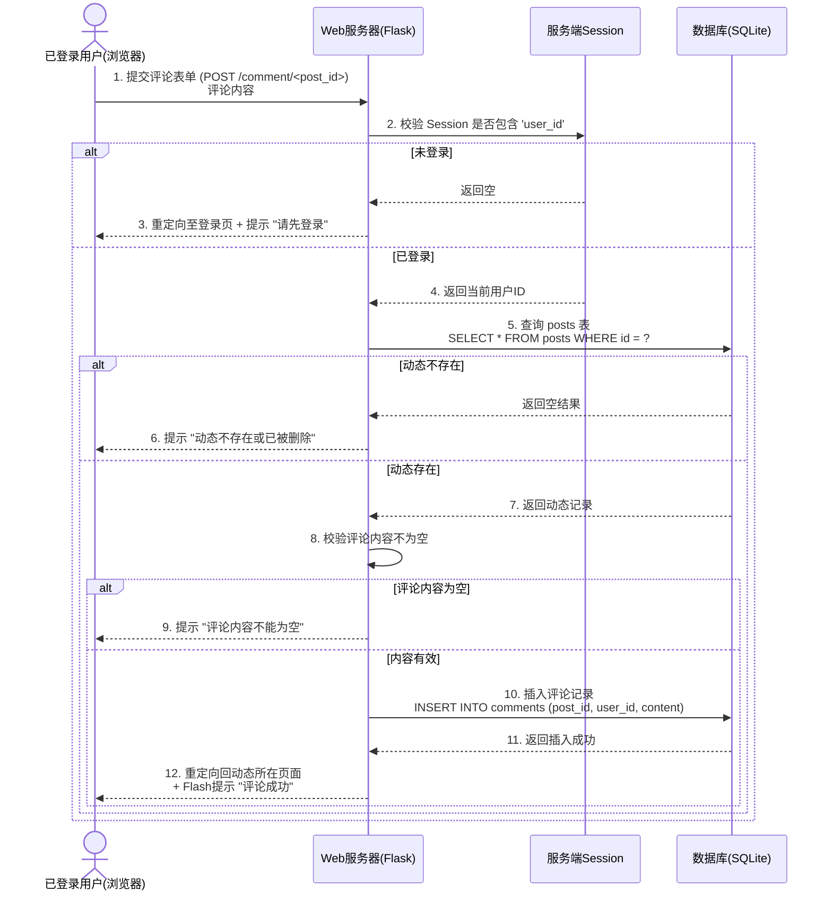
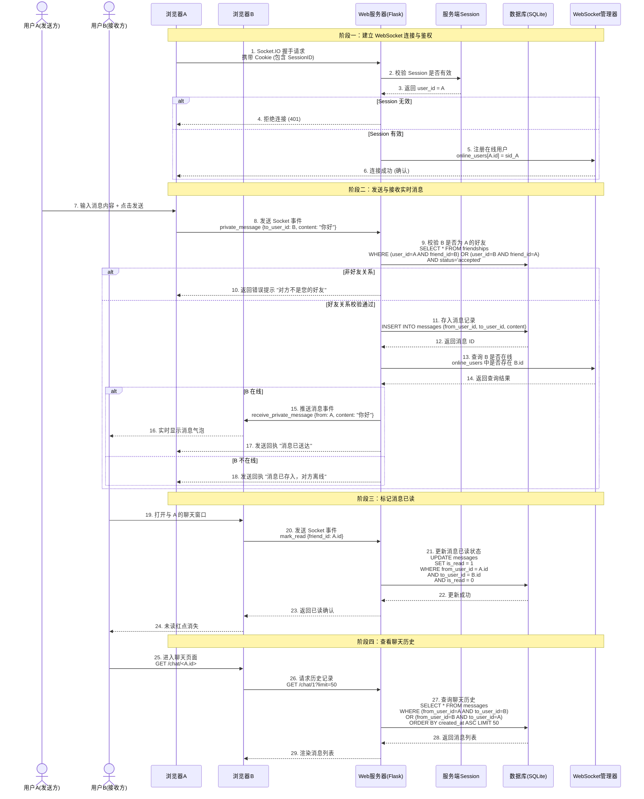

# WhuTalk — 简易社交平台 — 需求规格说明书

---

## 1.用户需求说明

### 1.1 用户角色定义

|角色编号|角色名称|角色描述|
|---|---|---|
|R-01|未注册访客|尚未注册账号，仅可访问登录页和注册页|
|R-02|已注册用户|拥有有效账号，可登录并使用全部功能|

### 1.2 用户业务操作场景（User Stories）

|场景编号|对应角色|场景描述|
|---|---|---|
|S-00|R-01|作为未注册访客，我希望填写用户名和密码进行账号注册，以便系统为我创建唯一身份，从而获得登录并使用平台的权限。|
|S-01|R-02|作为已注册用户，我希望输入用户名和密码登录系统，以便获得发布动态和管理好友的权限。|
|S-02|R-02|作为已注册用户，我希望修改个人简介和上传头像，以便向好友展示我的个性化信息。|
|S-03|R-02|作为已注册用户，我希望发布包含文字和配图的动态，以便记录和分享我的生活。|
|S-04|R-02|作为已注册用户，我希望按时间倒序查看我和所有好友的动态，以便不错过任何近况更新。|
|S-05|R-02|作为已注册用户，我希望通过用户名搜索其他用户并发送好友请求，以便建立社交关系。|
|S-06|R-02|作为已注册用户，我希望收到待处理请求并选择接受或拒绝，以便管理我的社交圈子。|
|S-07|R-02|作为已注册用户，我希望查看当前所有已建立的好友列表，以便清楚我的社交圈范围。|
|S-08|R-02|作为已注册用户，我希望对好友的动态发表文字评论，以便表达我的观点或与好友互动。|
|S-09|R-02|作为已注册用户，我希望与好友进行实时的文字聊天，以便获得即时沟通的社交体验。|

### 1.3 核心业务流程闭环（闭环逻辑）

- 注册与鉴权闭环：访客提交注册信息 → 系统生成账号并返回登录页 → 用户提交凭证 → 系统颁发会话凭证（Session） → 后续所有操作携带凭证。

- 社交关系闭环：用户A搜索用户B → 系统生成“待处理”关系记录 → 用户B登录查看通知 → 用户B执行“接受”或“拒绝” → 系统变更关系状态 → 关系生效或终结。

- 动态生产与消费闭环：用户发布动态（文字+图片） → 系统存储内容并关联发布者ID → 该用户及其好友刷新时间线 → 系统聚合查询并倒序渲染展示。

### 1.4 功能模块总览

| 模块编号 | 模块名称 | 功能ID | 功能点 |
| :--- | :--- | :--- | :--- |
| **M1** | 用户认证与鉴权 | FR-01 | 用户注册（用户名唯一性校验 + 密码加盐哈希存储） |
| | | FR-02 | 用户登录（密码验证 + Session 会话颁发） |
| | | FR-03 | 用户登出（清除 Session） |
| | | — | `@login_required` 鉴权装饰器（拦截未登录请求） |
| **M2** | 个人资料管理 | FR-04 | 查看个人主页（展示用户信息 + 历史动态） |
| | | FR-05 | 编辑个人资料（修改简介 + 上传头像） |
| **M3** | 内容发布与浏览 | FR-06 | 发布文字动态 |
| | | FR-07 | 发布带图动态（图片上传 + 路径存储） |
| | | FR-08 | 时间线聚合浏览（自己 + 好友动态，按时间倒序） |
| | | FR-13 | 发表评论（对动态发表文字评论） |
| | | FR-14 | 查看评论列表（按时间升序展示，含评论者信息） |
| **M4** | 好友关系管理 | FR-09 | 搜索用户并发送好友请求（含完整状态机校验） |
| | | FR-10 | 处理好友请求（接受 / 拒绝） |
| | | FR-11 | 查看好友列表（所有 `status=accepted` 的好友） |
| | | FR-12 | 查看待处理请求（别人发给我的 `status=pending` 请求） |
| **M5** | 基础设施与工具 | — | 数据库连接工具（`get_db()`） |
| | | — | 数据库初始化建表（`init_db()`） |
| | | — | 密码加盐哈希工具（`hash_password` / `check_password`） |
| | | — | 文件上传安全工具（`secure_filename` + 扩展名校验） |
| **M6** | 实时私信聊天 | FR-15 | WebSocket 连接建立（复用 Session 鉴权） |
| | | FR-16 | 发送实时消息（`private_message` 事件） |
| | | FR-17 | 标记消息已读（`mark_read` 事件） |
| | | FR-18 | 查看聊天历史（HTTP GET `/chat/<friend_id>`） |
| | | FR-19 | 查看会话列表（HTTP GET `/chat`，含未读计数） |
| | | FR-20 | 在线状态感知（好友上线/下线广播，附加功能） |

## 2.需求分析建模

### 2.1 系统用例图（Use Case Diagram）—— 定义功能边界



### 2.2 实体-关系图（ER Diagram）—— 定义数据结构



### 2.3 完整数据字典（Data Dictionary）

#### 2.3.1 用户表（users）

| 字段名 | 数据类型 | 空值（NULL） | 默认值 | 键/约束 | 索引建议 | 业务描述 |
| :--- | :--- | :--- | :--- | :--- | :--- | :--- |
| **id** | `INTEGER` | **NOT NULL** | 自动递增 | **PRIMARY KEY** | 主键自动索引 | 系统内部唯一标识，自增数字，不对外暴露业务含义 |
| **username** | `TEXT` (VARCHAR(50)) | **NOT NULL** | 无 | **UNIQUE** | 创建唯一索引 | 用户登录账号和搜索依据。**全局唯一**，长度限制 50 字符，建议字母/数字/下划线组成 |
| **password_hash** | `TEXT` (VARCHAR(128)) | **NOT NULL** | 无 | 无 | 无 | 存储加盐后的密码哈希值，格式固定为 `盐(16位十六进制):SHA256哈希值(64位)`，**严禁明文存储** |
| **bio** | `TEXT` | 允许 NULL | `NULL` | 无 | 无 | 用户个人简介，最长建议 200 字符，展示在个人主页 |
| **profile_pic** | `TEXT` (VARCHAR(200)) | 允许 NULL | `NULL` | 无 | 无 | 头像图片的相对路径（如 `uploads/avatar_1_20260706.jpg`）。若为空，前端展示默认头像 |
| **created_at** | `TIMESTAMP` / `DATETIME` | **NOT NULL** | `CURRENT_TIMESTAMP` | 无 | 建议按需（时间排序查询） | 账号注册时间，系统自动生成，不可手动修改 |

#### 2.3.2 动态表（posts）

| 字段名 | 数据类型 | 空值（NULL） | 默认值 | 键/约束 | 索引建议 | 业务描述 |
| :--- | :--- | :--- | :--- | :--- | :--- | :--- |
| **id** | `INTEGER` | **NOT NULL** | 自动递增 | **PRIMARY KEY** | 主键自动索引 | 动态唯一标识 |
| **user_id** | `INTEGER` | **NOT NULL** | 无 | **FOREIGN KEY (users.id)** | **必须创建索引**（高频查询条件） | 发布者的用户ID。**外键关联**，用于联表查询发布者昵称/头像 |
| **content** | `TEXT` | **NOT NULL** | 无 | 无 | 无 | 动态正文内容。**数据库层非空**，应用层需额外校验不能为纯空白字符 |
| **image_path** | `TEXT` (VARCHAR(200)) | 允许 NULL | `NULL` | 无 | 无 | 配图相对路径（如 `uploads/20260706120000_photo.jpg`）。为空表示纯文字动态 |
| **created_at** | `TIMESTAMP` / `DATETIME` | **NOT NULL** | `CURRENT_TIMESTAMP` | 无 | **创建复合索引** `(user_id, created_at DESC)` | 发布时间戳。**时间线按此字段降序排序**，是核心查询依据字段 |

#### 2.3.3 好友关系表（friendships）

| 字段名 | 数据类型 | 空值（NULL） | 默认值 | 键/约束 | 索引建议 | 业务描述 |
| :--- | :--- | :--- | :--- | :--- | :--- | :--- |
| **id** | `INTEGER` | **NOT NULL** | 自动递增 | **PRIMARY KEY** | 主键自动索引 | 好友关系记录唯一标识 |
| **user_id** | `INTEGER` | **NOT NULL** | 无 | **FOREIGN KEY (users.id)** | **创建复合索引** `(user_id, status)` | **发起请求方**的ID（主动加好友的人） |
| **friend_id** | `INTEGER` | **NOT NULL** | 无 | **FOREIGN KEY (users.id)** | **创建复合索引** `(friend_id, status)` | **接收请求方**的ID（被加好友的人） |
| **status** | `TEXT` (VARCHAR(10)) | **NOT NULL** | `'pending'` | **CHECK 约束**（仅允许 `pending`/`accepted`/`rejected`） | 见上述复合索引 | 关系状态。仅允许三个枚举值，用于控制好友请求的生命周期 |
| **created_at** | `TIMESTAMP` / `DATETIME` | **NOT NULL** | `CURRENT_TIMESTAMP` | 无 | 无 | 好友请求的发送时间（**注意**：该字段不随状态变更而更新，保留初始请求时间） |

##### 2.3.3.1 friendships 表额外约束（表级）

| 约束类型 | 约束内容 | 业务说明 |
| :--- | :--- | :--- |
| **UNIQUE 约束** | `(user_id, friend_id)` **联合唯一** | 防止同一对发起者→接收者重复发送请求。注意该约束是单向的（A→B 唯一），并不阻止 B→A 再发一条（两者被视为不同的“主动方向”）。业务层需结合逻辑判断，若 A→B 或 B→A 任一存在 `pending`/`accepted` 状态则拦截 |
| **CHECK 约束** | `status IN ('pending', 'accepted', 'rejected')` | 数据库层强校验，防止应用程序误写入非法状态值 |

### 2.3.4 好友关系表（friendships）

| 字段名 | 数据类型 | 空值（NULL） | 默认值 | 键/约束 | 索引建议 | 业务描述 |
| :--- | :--- | :--- | :--- | :--- | :--- | :--- |
| **id** | `INTEGER` | **NOT NULL** | 自动递增 | **PRIMARY KEY** | 主键自动索引 | 好友关系记录唯一标识 |
| **user_id** | `INTEGER` | **NOT NULL** | 无 | **FOREIGN KEY (users.id)** | **创建复合索引** `(user_id, status)` | **发起请求方**的ID（主动加好友的人） |
| **friend_id** | `INTEGER` | **NOT NULL** | 无 | **FOREIGN KEY (users.id)** | **创建复合索引** `(friend_id, status)` | **接收请求方**的ID（被加好友的人） |
| **status** | `TEXT` (VARCHAR(10)) | **NOT NULL** | `'pending'` | **CHECK 约束**（仅允许 `pending`/`accepted`/`rejected`） | 见上述复合索引 | 关系状态。仅允许三个枚举值，用于控制好友请求的生命周期 |
| **created_at** | `TIMESTAMP` / `DATETIME` | **NOT NULL** | `CURRENT_TIMESTAMP` | 无 | 无 | 好友请求的发送时间（**注意**：该字段不随状态变更而更新，保留初始请求时间） |

#### 2.3.4.1 friendships 表额外约束（表级）

| 约束类型 | 约束内容 | 业务说明 |
| :--- | :--- | :--- |
| **UNIQUE 约束** | `(user_id, friend_id)` **联合唯一** | 防止同一对发起者→接收者重复发送请求。注意该约束是单向的（A→B 唯一），并不阻止 B→A 再发一条（两者被视为不同的“主动方向”）。业务层需结合逻辑判断，若 A→B 或 B→A 任一存在 `pending`/`accepted` 状态则拦截 |
| **CHECK 约束** | `status IN ('pending', 'accepted', 'rejected')` | 数据库层强校验，防止应用程序误写入非法状态值 |

### 2.3.5 私信消息表（messages）

| 字段名 | 数据类型 | 空值（NULL） | 默认值 | 键/约束 | 索引建议 | 业务描述 |
| :--- | :--- | :--- | :--- | :--- | :--- | :--- |
| **id** | `INTEGER` | **NOT NULL** | 自动递增 | **PRIMARY KEY** | 主键自动索引 | 消息唯一标识 |
| **from_user_id** | `INTEGER` | **NOT NULL** | 无 | **FOREIGN KEY (users.id)** | **必须创建索引**（按发送方查消息） | 消息发送方的用户ID |
| **to_user_id** | `INTEGER` | **NOT NULL** | 无 | **FOREIGN KEY (users.id)** | **必须创建索引**（按接收方查消息） | 消息接收方的用户ID |
| **content** | `TEXT` | **NOT NULL** | 无 | 无 | 无 | 消息正文内容（纯文本，**不支持图片/表情包**）。数据库层非空，应用层需额外校验 |
| **is_read** | `BOOLEAN` / `INTEGER` | **NOT NULL** | `0` | 无 | **创建复合索引** `(to_user_id, is_read)` | 消息已读状态：`0`=未读，`1`=已读。用于计算未读消息数 |
| **created_at** | `TIMESTAMP` / `DATETIME` | **NOT NULL** | `CURRENT_TIMESTAMP` | 无 | **创建复合索引** `(from_user_id, to_user_id, created_at ASC)` | 消息发送时间戳。**聊天记录按此字段升序排序**（旧→新） |

### 2.3.6 关系约束与级联策略（物理设计说明）

| 外键字段 | 引用表 | 级联删除（ON DELETE） | 级联更新（ON UPDATE） | 设计理由 |
| :--- | :--- | :--- | :--- | :--- |
| `posts.user_id` | `users.id` | **RESTRICT**（拒绝删除） | **CASCADE** | 极简场景下，暂不处理用户注销导致的动态归属问题；若强制删除用户，需先清理其动态，本设计先限制删除 |
| `comments.user_id` | `users.id` | **RESTRICT**（拒绝删除） | **CASCADE** | 同上，保证评论者有效性 |
| `comments.post_id` | `posts.id` | **RESTRICT**（拒绝删除） | **CASCADE** | 同上，保证评论归属动态有效 |
| `friendships.user_id` | `users.id` | **RESTRICT**（拒绝删除） | **CASCADE** | 同上，避免出现“幽灵发起者” |
| `friendships.friend_id` | `users.id` | **RESTRICT**（拒绝删除） | **CASCADE** | 同上，避免出现“幽灵接收者” |
| `messages.from_user_id` | `users.id` | **RESTRICT**（拒绝删除） | **CASCADE** | 同上，保证消息发送方有效 |
| `messages.to_user_id` | `users.id` | **RESTRICT**（拒绝删除） | **CASCADE** | 同上，保证消息接收方有效 |

> **注**：为保持“越简单越好”的初心，实际开发中甚至可以不启用物理外键约束（由应用层逻辑保证一致性），但作为概念设计，此处明确标准。

### 2.3.7 索引策略汇总（针对查询性能优化）

基于 SRS 中的核心查询场景，建议创建以下索引（SQLite 默认主键自带索引，此处仅列额外索引）：

| 所属表 | 索引字段 | 类型 | 针对的查询场景 |
| :--- | :--- | :--- | :--- |
| `posts` | `(user_id, created_at DESC)` | 复合索引 | 个人主页查询：`WHERE user_id=? ORDER BY created_at DESC` |
| `posts` | `(created_at DESC)` | 单列索引（可选） | 全局时间线排序（若后续扩展） |
| `comments` | `(post_id, created_at ASC)` | 复合索引 | 动态详情评论列表：`WHERE post_id=? ORDER BY created_at ASC` |
| `comments` | `(user_id)` | 单列索引 | 查询“某用户发表的所有评论”（个人主页统计用） |
| `friendships` | `(user_id, status)` | 复合索引 | 查询“我发起的待处理/已接受请求” |
| `friendships` | `(friend_id, status)` | 复合索引 | 查询“别人发给我的待处理请求”及“我的所有好友”（`status='accepted'`） |
| `messages` | `(from_user_id, to_user_id, created_at ASC)` | 复合索引 | 查询“两个用户之间的完整聊天记录”，按时间升序 |
| `messages` | `(to_user_id, is_read)` | 复合索引 | 查询“某用户所有未读消息计数” |
| `users` | `(username)` | 唯一索引（已由 UNIQUE 约束隐式创建） | 登录校验 + 搜索用户 |

### 2.3.8 数据字典与 SRS 功能追溯（验证覆盖度）

| SRS 功能 ID | 涉及的数据表（字段） | 字典是否覆盖 |
| :--- | :--- | :--- |
| FR-01 注册 | `users`（username, password_hash, bio） | ✅ |
| FR-02 登录 | `users`（username, password_hash） | ✅ |
| FR-05 编辑资料 | `users`（bio, profile_pic） | ✅ |
| FR-06/07 发布动态 | `posts`（user_id, content, image_path, created_at） | ✅ |
| FR-08 时间线 | `posts`（全字段）+ `users`（username, profile_pic）+ `friendships`（status） | ✅ |
| FR-09/10 好友操作 | `friendships`（user_id, friend_id, status, created_at） | ✅ |
| FR-11 好友列表 | `friendships`（status）+ `users`（username, profile_pic） | ✅ |
| FR-13 发表评论 | `comments`（post_id, user_id, content, created_at） | ✅ |
| FR-14 查看评论 | `comments`（post_id, user_id, content, created_at）+ `users`（username, profile_pic） | ✅ |
| FR-16 发送消息 | `messages`（from_user_id, to_user_id, content, is_read, created_at） | ✅ |
| FR-17 标记已读 | `messages`（to_user_id, is_read） | ✅ |
| FR-18 聊天历史 | `messages`（from_user_id, to_user_id, content, created_at） | ✅ |
| FR-19 会话列表 | `messages`（from_user_id, to_user_id, is_read）+ `users` | ✅ |

### 2.4 好友关系状态机图（State Machine）—— 定义业务生命周期



### 2.5 核心业务时序图（Sequence Diagram）—— 定义交互顺序

#### 2.5.1 申请添加好友时序图



#### 2.5.2 用户注册时序图



#### 2.5.3 用户登录时序图



#### 2.5.4 发布图文动态时序图



#### 2.5.5 发表评论时序图



#### 2.5.6 实时私信时序图（WebSocket 方案）



## 3. 非功能性需求说明（NFR）

### 3.1 开发环境

| 环境项 | 版本/规格要求 | 说明 |
| :--- | :--- | :--- |
| **操作系统** | Windows 10/11、macOS 10.15+、Ubuntu 18.04+ | 跨平台均可，无特殊内核依赖 |
| **Python 解释器** | **Python 3.8 及以上版本**（含 3.9、3.10、3.11、3.12） | 必须使用 Python 3.x，**不支持 Python 2.x** |
| **包管理工具** | `pip`（版本 ≥ 20.0） | 用于安装项目依赖项 |
| **代码编辑器** | VSCode / PyCharm / Sublime Text 任选 | 无强制要求，文本编辑器即可 |
| **终端/命令行** | Windows CMD/PowerShell、macOS Terminal、Linux Shell | 用于执行启动命令 |

### 3.2 运行环境

| 环境项 | 版本/规格要求 | 说明 |
| :--- | :--- | :--- |
| **服务器主机** | 本地个人电脑 或 云服务器（最低配置：1核CPU / 512MB内存） | 开发阶段直接运行于本机，生产部署可上传至轻量云服务器 |
| **数据库** | **SQLite 3**（Python 标准库自带，无需单独安装） | 数据库文件（`social.db`）随项目生成，无需外部数据库服务 |
| **Web 服务器** | Flask 内置开发服务器（Werkzeug） | 通过 `python app.py` 启动，默认监听 `127.0.0.1:5000` |
| **客户端浏览器** | Chrome / Firefox / Edge / Safari 最新稳定版 | 用于访问网页界面，无需安装任何插件 |

### 3.3 系统依赖项

> **安装方式**：在项目根目录执行 `pip install -r requirements.txt`。  
> **极简原则**：仅依赖 **5 个** 核心库（较原计划新增 2 个），全部安装耗时不超过 2 分钟。

| 依赖包名称 | 版本推荐 | 作用描述 |
| :--- | :--- | :--- |
| **Flask** | `2.3.3` | 提供 Web 路由、Session 管理、模板渲染核心能力 |
| **Werkzeug** | `2.3.7` | Flask 底层 WSGI 工具库（含文件上传处理、安全辅助函数） |
| **blinker** | `1.6.2` | Flask 信号支持库（随 Flask 安装，建议显式锁定版本） |
| **Flask-SocketIO** | `5.3.6` | 基于 Socket.IO 协议的 WebSocket 封装库，提供实时双向通信能力 |
| **eventlet** | `0.33.3` | 异步协程库，让 Flask 支持并发 WebSocket 长连接，替换默认同步服务器 |

> **注意**：
> - 由于使用 SQLite，无需安装 `sqlite3` 依赖包（Python 标准库已内置）。
> - 无需额外安装数据库驱动（如 pymysql/psycopg2）、异步框架（如 asyncio/aiohttp）、图像处理库（如 PIL）。
> - **启动方式变更**：引入 WebSocket 后，启动命令由 `app.run()` 变为 `socketio.run(app, host='0.0.0.0', port=5000)`。

### 3.4 标准 `requirements.txt` 文件内容

将以下内容保存为项目根目录下的 `requirements.txt` 文件：

```txt
Flask==2.3.3
Werkzeug==2.3.7
blinker==1.6.2
Flask-SocketIO==5.3.6
eventlet==0.33.3
```